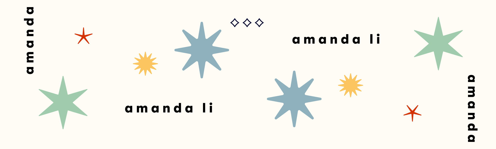

  

i’m a computer science student at queen’s university with a love for building products that are thoughtful, useful, and a little bit fun!

with experience across product design, development, and marketing, i’ve led multidisciplinary teams, built full-stack apps, and pitched winning ideas at competitions. whether it’s launching a campus UX club or refining listing flows at a proptech startup, i thrive at the intersection of creativity, strategy, and execution.

i'm currently building [queen's ux club](https://www.instagram.com/queens.ux), and always down to chat about design systems, product growth, or your favorite brunch foods.

### what i’m looking for:
- product internships (pm / design / strategy / tech)
- startup-y teams where builders wear many hats
- opportunities to make an impact through intuitive user experiences

### languages

### frameworks & tools

---

### let’s connect! :)
send me an email: [amanda.li@queensu.ca](mailto:amanda.li@queensu.ca)  
connect with me on [linkedin](https://www.linkedin.com/in/amanda-li-1889a9252/)
